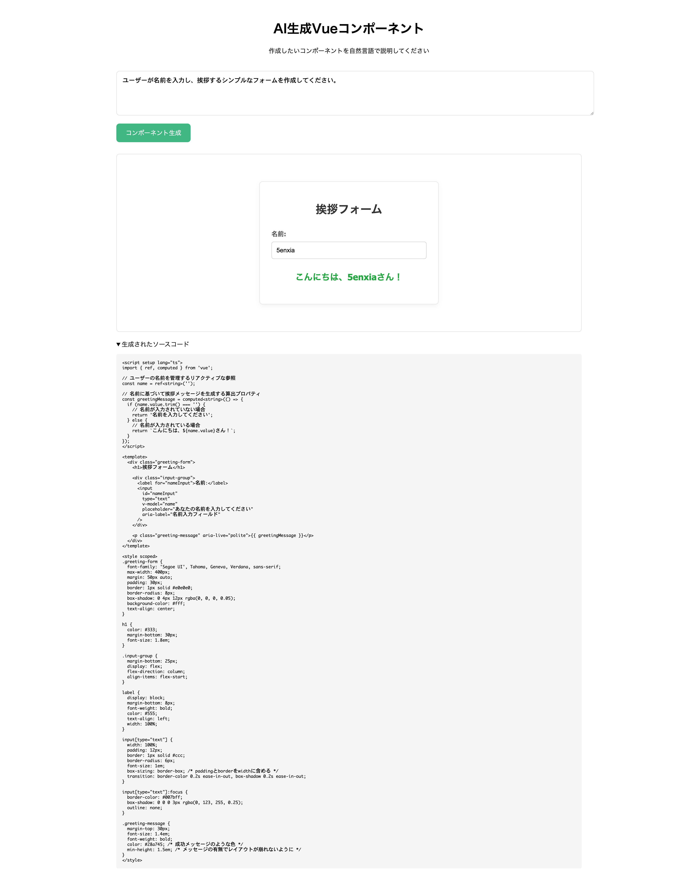

# AIに動的にSFC生成させ、Vueアプリで表示する方法

## はじめに

本記事では、AI（LLM）が生成したVue Single File Component（SFC）を、Vue アプリケーション内で動的にレンダリングするシステムの構築方法を紹介します。

通常、Vue コンポーネントはViteなどでビルド・バンドルして使用しますが、2025年現在、LLMの生成精度向上により、ClaudeのArtifactsのようにWebページをリアルタイムで生成することが可能になっています。

この技術を活用し、ビルドプロセスを経ずにブラウザ上でVueコンポーネントを動的に実行する方法を解説します。

## 前提条件

- Vue 3の基本的な知識
- TypeScriptの基本的な知識
- Node.js 20以上
- Google AI Studio APIキーの取得

## アーキテクチャ

```text
ユーザー入力 → Gemini API → SFC生成 → vue3-sfc-loader → 動的レンダリング
```

## Vue プロジェクトのセットアップ

```bash
npm create vue@latest
```

セットアップ時の選択例：

```bash
> npx
> create-vue

┌  Vue.js - The Progressive JavaScript Framework
│
◇  Project name (target directory):
│  vue-generated-ui
│
◇  Select features to include in your project: (↑/↓ to navigate, space to select, a to toggle all, enter to confirm)
│  TypeScript
│
◇  Select experimental features to include in your project: (↑/↓ to navigate, space to select, a to toggle all, enter to confirm)
│  none
│
◇  Skip all example code and start with a blank Vue project?
│  Yes

Scaffolding project in /Users/takayasumorishita/vue-server-component/vue-generated-ui...
│
└  Done. Now run:

   cd vue-generated-ui
   npm install
   npm run dev

| Optional: Initialize Git in your project directory with:

   git init && git add -A && git commit -m "initial commit"
```

## vue3-sfc-loader について

`vue3-sfc-loader`は、Vue.jsの単一ファイルコンポーネント（SFC）をブラウザ上で直接ロード・実行できるJavaScriptライブラリです。

通常、Vueコンポーネントはビルド時に処理する必要がありますが、このライブラリを使用することで、ビルドプロセスを経ずにブラウザ上で`.vue`ファイルを動的にコンパイル・使用できます。

**公式リポジトリ:** https://github.com/FranckFreiburger/vue3-sfc-loader

### メリット

- **効率的な生成時間**: HTMLページ全体を生成するより、SFCの方が短時間で生成可能
- **既存コンポーネントの活用**: Vueアプリケーションに登録済みのコンポーネントを再利用可能
- **開発効率の向上**: プロトタイピングや動的UI生成に最適

iframeやShadow DOMでサンドボックスを作成してUIをレンダリングすることも可能ですが、AIに一からHTMLでWebページを生成させると時間がかかります。対してSFCであれば、既存のコンポーネントライブラリを指示に含めることで、より効率的な出力が可能です。

### インストール

```bash
npm install vue3-sfc-loader
```

## Google AI Studio APIの準備

[Gemini API のクイックスタート | Google AI for Developers](https://ai.google.dev/gemini-api/docs/quickstart?lang=python&hl=ja)

本システムではGoogle AI Studio APIを使用します。無料枠があり、コード生成能力も十分です。

1. API Keyを発行
2. `.env`ファイルを作成し、API Keyを設定

```bash
VITE_GOOGLE_GEN_AI_API_KEY=your_api_key_here
```

## 実装方法

### プロジェクト構成

```text
src/
├── App.vue                    # メインアプリケーション
├── GeneratedUIContainer.vue   # SFCレンダリングコンテナ
└── generate.ts               # AI生成用Composable
```

### 1. GeneratedUIContainer.vue

`vue3-sfc-loader`と`defineAsyncComponent`を使用してLLMが生成したSFCをレンダリングします。

```vue
<script setup lang="ts">
import { defineAsyncComponent, computed } from "vue";
import * as Vue from "vue";
import { loadModule } from "vue3-sfc-loader";

const props = defineProps<{
  sfcText: string;
}>();

const GeneratedSfc = computed(() => {
  const options = {
    moduleCache: { vue: Vue },
    getFile: () => props.sfcText,
    addStyle(textContent: any) {
      const style = Object.assign(document.createElement("style"), {
        textContent,
      });
      const ref = document.head.getElementsByTagName("style")[0] || null;
      document.head.insertBefore(style, ref);
    },
  };

  return defineAsyncComponent(() => loadModule("GeneratedSfc.vue", options));
});
</script>

<template>
  <div class="container">
    <div class="preview">
      <GeneratedSfc />
    </div>
    <details class="source-code">
      <summary>生成されたソースコード</summary>
      <pre><code>{{ sfcText }}</code></pre>
    </details>
  </div>
</template>

<style scoped>
.container {
  margin: 20px 0;
}

.preview {
  border: 1px solid #ddd;
  padding: 20px;
  margin-bottom: 20px;
  border-radius: 8px;
}

.source-code {
  margin-top: 20px;
}

.source-code pre {
  background: #f5f5f5;
  padding: 15px;
  border-radius: 4px;
  overflow-x: auto;
}
</style>
```

### 2. generate.ts

`@google/genai`を使用してSFCを生成するComposableです。

```typescript
import { GoogleGenAI } from "@google/genai";
import { ref } from "vue";

const ai = new GoogleGenAI({
  apiKey: import.meta.env.VITE_GOOGLE_GEN_AI_API_KEY,
});

export const generateSFC = () => {
  const prompt = ref(
    "ユーザーが名前を入力し、挨拶するシンプルなフォームを作成してください。"
  );
  const sfcText = ref("");
  const isLoading = ref(false);

  async function generate() {
    if (!prompt.value.trim()) return;
    
    sfcText.value = "";
    isLoading.value = true;
    
    try {
      const response = await ai.models.generateContent({
        model: "gemini-2.5-flash",
        contents: prompt.value,
        config: {
          systemInstruction: `あなたは熟練したVue 3 + TypeScriptのフロントエンドエンジニアです。以下の制約に従い、ユーザー指示を満たす単一のVue Single File Component (SFC)を1つだけ出力してください。

制約事項:
- 出力はSFCのソースコードのみ。説明文・マークダウン・コードフェンスは出力しない
- Composition APIを<script setup lang="ts">で使用し、TypeScriptで型を明示する
- 追加の依存ライブラリは使用しない。自己完結し、そのままビルド可能なコードにする
- UIテキストは日本語を使用する
- 不明点は合理的に補完して、最低限動作する実装にする
- 不要なコメントやログ、外部API呼び出しは含めない`,
        },
      });
      
      const text = response.text;
      sfcText.value = text?.trim?.() ?? "";
    } catch (err) {
      console.error("SFC生成エラー:", err);
      sfcText.value = "// エラーが発生しました。APIキーを確認してください。";
    } finally {
      isLoading.value = false;
    }
  }

  return {
    prompt,
    sfcText,
    generate,
    isLoading,
  };
};
```

### 3. App.vue

ユーザーインターフェースのメインコンポーネントです。

```vue
<script setup lang="ts">
import GeneratedUIContainer from "./GeneratedUIContainer.vue";
import { generateSFC } from "./generate";

const { sfcText, generate, prompt, isLoading } = generateSFC();
</script>

<template>
  <div class="app">
    <header>
      <h1>AI生成Vueコンポーネント</h1>
      <p>作成したいコンポーネントを自然言語で説明してください</p>
    </header>
    
    <main>
      <div class="input-section">
        <textarea 
          v-model="prompt" 
          rows="5" 
          cols="80"
          placeholder="例: ユーザーが名前を入力し、挨拶するシンプルなフォームを作成してください。"
          class="prompt-input"
        />
        <button 
          @click="generate" 
          :disabled="isLoading || !prompt.trim()"
          class="generate-button"
        >
          {{ isLoading ? "生成中..." : "コンポーネント生成" }}
        </button>
      </div>
      
      <GeneratedUIContainer v-if="sfcText" :sfc-text="sfcText" />
    </main>
  </div>
</template>

<style scoped>
.app {
  max-width: 1200px;
  margin: 0 auto;
  padding: 20px;
}

header {
  text-align: center;
  margin-bottom: 40px;
}

.input-section {
  margin-bottom: 30px;
}

.prompt-input {
  width: 100%;
  padding: 15px;
  border: 1px solid #ddd;
  border-radius: 8px;
  font-size: 16px;
  resize: vertical;
  margin-bottom: 15px;
}

.generate-button {
  background: #42b883;
  color: white;
  border: none;
  padding: 12px 24px;
  border-radius: 8px;
  font-size: 16px;
  cursor: pointer;
  transition: background 0.2s;
}

.generate-button:hover:not(:disabled) {
  background: #369870;
}

.generate-button:disabled {
  background: #ccc;
  cursor: not-allowed;
}
</style>
```

## 生成されたコンポーネントの例



```vue
<script setup lang="ts">
import { ref, computed } from 'vue';

// ユーザーの名前を管理するリアクティブな参照
const name = ref<string>('');

// 名前に基づいて挨拶メッセージを生成する算出プロパティ
const greetingMessage = computed<string>(() => {
  if (name.value.trim() === '') {
    // 名前が入力されていない場合
    return '名前を入力してください';
  } else {
    // 名前が入力されている場合
    return `こんにちは、${name.value}さん！`;
  }
});
</script>

<template>
  <div class="greeting-form">
    <h1>挨拶フォーム</h1>

    <div class="input-group">
      <label for="nameInput">名前:</label>
      <input
        id="nameInput"
        type="text"
        v-model="name"
        placeholder="あなたの名前を入力してください"
        aria-label="名前入力フィールド"
      />
    </div>

    <p class="greeting-message" aria-live="polite">{{ greetingMessage }}</p>
  </div>
</template>

<style scoped>
.greeting-form {
  font-family: 'Segoe UI', Tahoma, Geneva, Verdana, sans-serif;
  max-width: 400px;
  margin: 50px auto;
  padding: 30px;
  border: 1px solid #e0e0e0;
  border-radius: 8px;
  box-shadow: 0 4px 12px rgba(0, 0, 0, 0.05);
  background-color: #fff;
  text-align: center;
}

h1 {
  color: #333;
  margin-bottom: 30px;
  font-size: 1.8em;
}

.input-group {
  margin-bottom: 25px;
  display: flex;
  flex-direction: column;
  align-items: flex-start;
}

label {
  display: block;
  margin-bottom: 8px;
  font-weight: bold;
  color: #555;
  text-align: left;
  width: 100%;
}

input[type="text"] {
  width: 100%;
  padding: 12px;
  border: 1px solid #ccc;
  border-radius: 6px;
  font-size: 1em;
  box-sizing: border-box; /* paddingとborderをwidthに含める */
  transition: border-color 0.2s ease-in-out, box-shadow 0.2s ease-in-out;
}

input[type="text"]:focus {
  border-color: #007bff;
  box-shadow: 0 0 0 3px rgba(0, 123, 255, 0.25);
  outline: none;
}

.greeting-message {
  margin-top: 30px;
  font-size: 1.4em;
  font-weight: bold;
  color: #28a745; /* 成功メッセージのような色 */
  min-height: 1.5em; /* メッセージの有無でレイアウトが崩れないように */
}
</style>
```

## 使い方

1. アプリケーションを起動
2. テキストエリアに作成したいコンポーネントの説明を入力
3. 「コンポーネント生成」ボタンをクリック
4. 生成されたVueコンポーネントがリアルタイムでレンダリングされる

## まとめ

本記事では、`vue3-sfc-loader`とGoogle AI APIを活用して、AI生成Vueコンポーネントをリアルタイムでレンダリングするシステムを構築しました。

これにより、開発者が事前に作成したコンポーネントだけでなく、ユーザーが自然言語で指示した内容に基づき、動的にUIを生成・表示できるようになり、より柔軟なUIが実現できます。